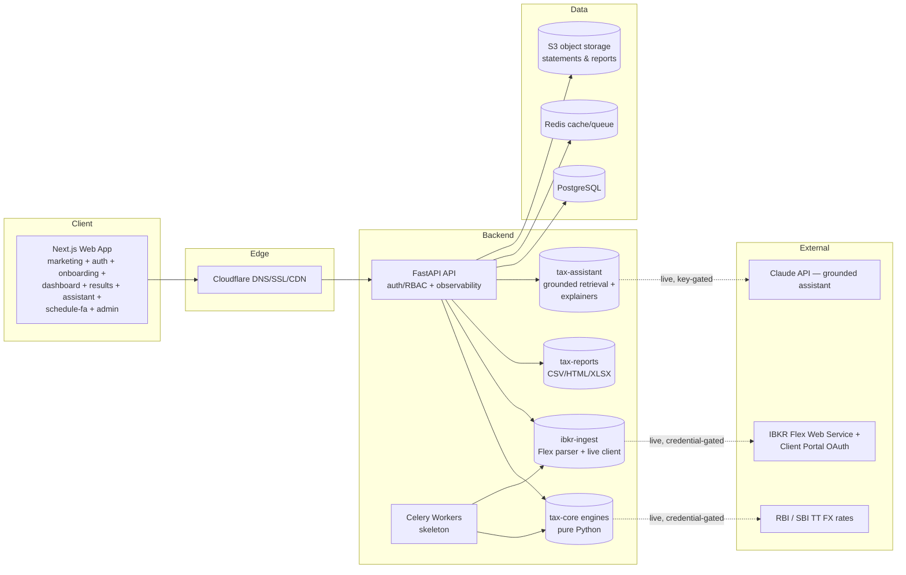
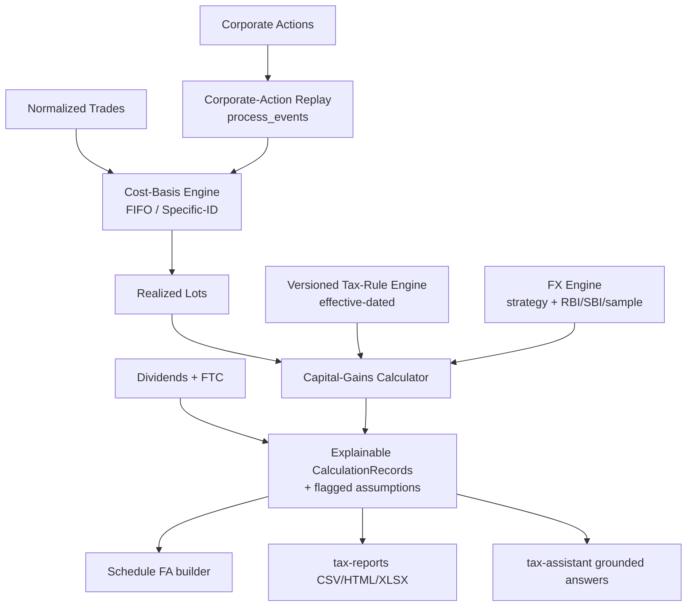
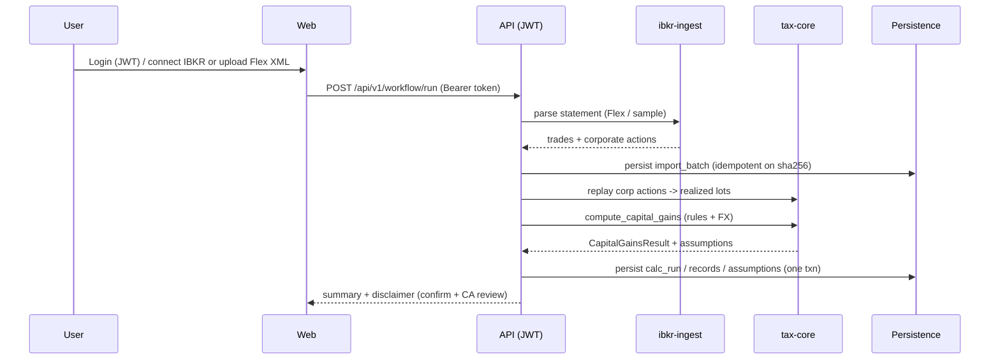

# Architecture — IBKR Indian Tax Assistant

> **Reference assistance only.** All tax computations are estimates and **must be
> reviewed and verified by a certified Chartered Accountant (CA) in India**
> before filing. This is not tax advice.

## 1. Purpose

Help **Indian tax residents** who invest globally through **Interactive Brokers
(IBKR)** compute Indian capital-gains and dividend tax on foreign securities,
and produce audit-ready, CA-reviewable working papers.

## 2. High-level system

Dashed edges are **implemented but credential/key-gated** transports: they are
coded and unit-tested with injected fakes, and activate when real tokens/keys
are supplied (see `ROADMAP.md`).

## 3. Monorepo layout

| Path | What | Status |
|---|---|---|
| `packages/tax-core` | Pure-Python deterministic engines: rules, FIFO/Specific-ID cost basis, corporate-action replay, FX engine + providers, capital-gains calculator, dividends + FTC, Schedule FA | **Implemented + tested (60 tests)** |
| `packages/ibkr-ingest` | IBKR Flex Query XML parser + **live Flex Web Service client** + sample provider | **Implemented + tested (14 tests)** |
| `packages/tax-reports` | Audit-ready document generator → CSV / HTML / XLSX | **Implemented + tested (5 tests)** |
| `packages/tax-assistant` | Grounded retrieval + deterministic `TemplateExplainer` + `LLMExplainer` interface | **Implemented + tested (6 tests)** |
| `packages/ts-shared` | Shared TypeScript types for the web app | **Implemented** |
| `apps/api` | FastAPI app: auth/JWT/RBAC/MFA, admin, imports, calculations, questionnaire, documents, assistant, schedules, persisted workflow, observability, Alembic, Celery skeleton, seeding | **Implemented + tested (56 tests)** |
| `apps/web` | Next.js marketing + SEO + INR pricing + auth + onboarding + dashboard + results + assistant + schedule-fa + admin | **Implemented + tested (30 Vitest tests)** |
| `config/tax_rules` | Versioned tax-rule + FX-strategy YAML (source of truth for policy) | **Implemented** |
| `infra` | Terraform **reference** modules (AWS ap-south-1 + Cloudflare) + docker-compose | **Reference IaC (apply credential-gated)** |
| `docs` | Architecture, design, DB/ER, API reference, changelog, security, cost, deploy, tax rules, pricing/GTM, roadmap | This set |

Total automated tests across the repo: **~171** (141 Python + 30 web).

## 4. The deterministic financial core (`tax-core`)

Pure Python, **no web/DB dependencies**, so it is unit-testable in isolation and
reusable across API + workers. It defines `Protocol` interfaces
(`RuleRepository`, `FxRateProvider`, `StatementProvider`); the API supplies
concrete SQLAlchemy/HTTP implementations.

Submodules (`packages/tax-core/src/ibkr_tax_core/`):

- `rules/` — versioned, effective-dated rule models, loader, resolver, repository.
- `costbasis/` — FIFO / Specific-ID matching (`matching.py`) and
  **corporate-action-aware replay** (`replay.py` → `process_events`).
- `capitalgains/` — capital-gains calculator emitting explainable
  `CalculationRecord`s + `AssumptionFlag`s.
- `dividends/` — gross/withholding/net dividend computation + **Foreign Tax
  Credit**.
- `fx/` — conversion engine + strategy, with providers in `fx/providers/`:
  `static_sample` (in-memory), `rbi` (RBI reference) and `sbi_tt` (SBI TT). The
  RBI/SBI providers are **safe-by-default**: with no injected HTTP transport they
  raise `FxRateUnavailableError` rather than touch the network.
- `schedulefa/` — Schedule FA (foreign assets) row builder.
- `money.py`, `enums.py`, `domain.py` — Decimal money, enums, domain objects.

**Non-negotiable principles** (enforced in code):

1. **`Decimal` everywhere** — `float` is rejected at boundaries (`money.D`).
2. **No hardcoded tax rules** — rates/thresholds/surcharge/cess live in
   versioned, effective-dated YAML → DB tables. Engines hold *mechanism*.
3. **Effective-dating + audit trails** — rules are append-only/versioned; lot
   adjustments keep a full `LotAdjustment` history.
4. **Interpretive choices are data** — surfaced as `AssumptionFlag`s requiring
   user confirmation (and CA verification), never silently baked in.
5. **Explainability is first-class** — every gain emits a `CalculationRecord`
   capturing inputs, intermediate values, the exact rule version and FX source
   references, to ground audit reports and the AI assistant (no hallucinations).

## 5. Request flows

**Authenticated persisted workflow**

The demo endpoints (`/api/v1/calculations/demo`, `/imports/sample`,
`/schedules/demo/*`, `/documents/demo/*`, `/assistant/demo/explain`) run the
same engines in-memory with no DB or auth.

## 6. Cross-cutting concerns

- **Auth & RBAC:** JWT (HS256) bearer auth; roles `investor` / `tax_consultant`
  / `admin`; `require_role` dependency guards admin endpoints; register / verify
  email / login / password-reset / **MFA (TOTP)** flows. Broker tokens are
  encrypted at rest (Fernet, key derived from `SECRET_KEY`; KMS envelope
  encryption intended for production).
- **Observability:** structured JSON logging, `X-Request-ID` propagation
  middleware, `/health`, `/health/ready`, `/metrics` (Prometheus text format),
  and Sentry-ready error tracking (no-op without `SENTRY_DSN`).
- **Persistence:** SQLAlchemy 2.0 models + Alembic migrations; lazily
  initialized engine so the app stays importable without a DB.
- **Disclaimer:** the CA-verification disclaimer is embedded in the OpenAPI
  description and returned in every computation/result payload.

## 7. Technology choices

- **Frontend:** Next.js (App Router), TypeScript, Tailwind, ShadCN — great SEO
  (SSR/ISR), strong DX, easy Vercel hosting.
- **Backend:** Python FastAPI — the tax math is Python; FastAPI gives typed
  OpenAPI, async I/O, and clean DI for the engine `Protocol`s.
- **DB:** PostgreSQL — relational integrity for tax lots / versioned rules /
  audit. **Redis** for caching + Celery broker. **S3** for statements & reports.
- **Queue:** Celery (skeleton) — historical imports and report generation are
  long-running.
- **LLM:** Claude (`AnthropicExplainer`, default model `claude-sonnet-4-6`),
  grounded strictly on the user's own computed records.

See `SYSTEM_DESIGN.md` for component-level detail, `DATABASE.md` for the schema,
`API_REFERENCE.md` for the endpoint catalogue, and `SECURITY.md`,
`DEPLOYMENT.md`, `COST_ESTIMATES.md`, `PRICING_GTM.md`, `ROADMAP.md`.
