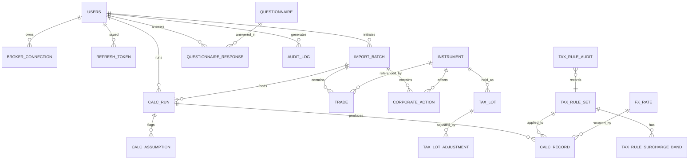
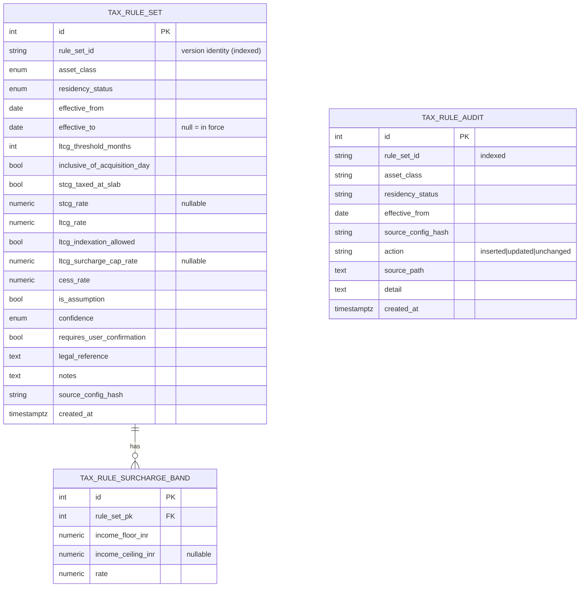

# Database Design — IBKR Indian Tax Assistant

> Money columns use `NUMERIC`/`Decimal`, never floating point.
> Quantities use `NUMERIC(28,8)`; FX rates `NUMERIC(18,6)`; rates `NUMERIC(8,6)`.

SQLAlchemy 2.0 models live under
`apps/api/src/ibkr_tax_api/db/models/` (`user.py`, `tax_rule.py`, `trading.py`,
`calc.py`, `questionnaire.py`). Migrations are in
`apps/api/alembic/versions/`.

## ER diagram (core)

> Note: `TAX_LOT`, `TRADE`, `CORPORATE_ACTION`, `FX_RATE`, and `CALC_RECORD`
> reference instruments/rules/FX by business key (symbol / rule_set_id /
> source_ref) rather than always by hard FK, mirroring the engine domain
> objects. `instrument` is the securities master used for joins/lookups.

## Versioned tax rules (no hardcoding)

- **Append-only versioning.** Superseding a rule sets `effective_to` on the old
  row and inserts a new row; nothing is mutated in place.
- **Unique** `(asset_class, residency_status, effective_from)`. Overlapping
  effective ranges are rejected by the loader and defensively by the resolver.
- **Idempotent seeding** keyed on `source_config_hash`; every seed/supersede
  writes a `tax_rule_audit` row (`inserted` / `updated` / `unchanged`).

## Table catalogue

`__tablename__` values are exactly as defined in the models.

| Table (`__tablename__`) | Purpose / key columns |
|---|---|
| `users` | accounts; `email` (unique), `hashed_password`, `role` ∈ {investor, tax_consultant, admin}, `mfa_enabled`, **`mfa_secret`** (Base32 TOTP, nullable), `email_verified`, `created_at` |
| `broker_connection` | per-user IBKR linkage; `user_id` FK→users (cascade); encrypted **`access_token_ciphertext`** / **`refresh_token_ciphertext`**, `token_encryption_key_id`, `refresh_token_expires_at`, `last_rotated_at`, `rotation_count` |
| `refresh_token` | server-side **rotatable** auth refresh tokens; `user_id` FK→users (cascade); **`token_hash`** (SHA-256, unique — raw value never stored), `expires_at`, `revoked`, self-referential `rotated_from` for reuse detection / chain revocation |
| `tax_rule_set` | versioned, effective-dated rule (see above) |
| `tax_rule_surcharge_band` | surcharge bands; `rule_set_pk` FK→tax_rule_set (cascade); `income_floor_inr`, `income_ceiling_inr`, `rate` |
| `tax_rule_audit` | append-only seeding/version audit (`inserted`/`updated`/`unchanged`) |
| `instrument` | securities master; `symbol` (indexed), `asset_class`, `description`; unique `(symbol, asset_class)` |
| `import_batch` | one ingestion; `user_id` FK→users (set null), `account_id`, `source` (flex_query/sample/…), `file_name`, **`sha256`** (idempotency), `trade_count`, `corp_action_count` |
| `trade` | normalized buys/sells; `import_batch_id` FK→import_batch (set null), `trade_id` (indexed), `symbol`, `asset_class`, `side`, `quantity`, `price`, `fees`, trade/settlement currencies + dates |
| `tax_lot` | open/partially-consumed lots; `lot_id` (indexed), `symbol`, `acquisition_date`, `original_quantity`, `remaining_quantity`, `cost_per_unit`, `cost_currency`, `source_trade_id` |
| `tax_lot_adjustment` | audit of corporate-action adjustments; `tax_lot_pk` FK→tax_lot (cascade); `type`, `applied_on`, qty/cost before+after |
| `corporate_action` | splits, reverse-splits, bonus, spin-offs, mergers, rights; `import_batch_id` FK (set null), `action_id` (indexed), `symbol`, `ex_date`, `type`, ratios, `cash_in_lieu`, `target_symbol`, `cost_allocation_pct` |
| `fx_rate` | cached FX observations; `base_currency`, `quote_currency`, `rate`, `rate_date`, `rate_type` (reference/tt_buy/tt_sell), `source`; unique `(base, quote, date, rate_type, source)` |
| `calc_run` | one capital-gains computation; `user_id` FK (set null), `import_batch_id` FK (set null), `financial_year`, `residency_status`, `fx_strategy`, STCG/LTCG/tax/surcharge/cess totals, `surcharge_rate_applied` |
| `calc_record` | per-lot explainable record; `run_id` FK→calc_run (cascade); `gain_type` (ST/LT), dates, holding period, INR cost/proceeds/gain, `indexation_applied`, `rule_set_id`, `rule_effective_from`, `explanation` |
| `calc_assumption` | flagged assumptions; `run_id` FK→calc_run (cascade); `source`, `message`, `confidence`, `requires_user_confirmation`, `legal_reference` |
| `questionnaire` | versioned questionnaire schema; `key` (indexed), `version`, `title`, `schema_json` |
| `questionnaire_response` | user answers; `questionnaire_id` FK (cascade), `user_id` FK (set null), `answers_json` |
| `audit_log` | append-only activity log; `user_id` FK (set null), `action`, `entity_type`, `entity_id`, `detail`, `created_at` |

## Token encryption

`broker_connection.access_token_ciphertext` and `refresh_token_ciphertext` are
encrypted at rest with **Fernet** (AES-128-CBC + HMAC-SHA256). In local/dev the
key is derived from `settings.SECRET_KEY`; `token_encryption_key_id` stamps which
key version was used so keys can rotate without re-reading plaintext. For
production, **envelope encryption via a KMS** is the intended posture (see
`apps/api/src/ibkr_tax_api/security/crypto.py` and `SECURITY.md`).

## Migrations

Alembic under `apps/api/alembic/versions/`:

- `0001_initial` — creates all core tables and enums.
- `0002_user_mfa_secret` — adds `users.mfa_secret` (Base32 TOTP secret).
- `0003_refresh_token` — adds the `refresh_token` table (hashed, rotatable,
  revocable; self-referential `rotated_from` for reuse detection).

`make seed` (or `python -m ibkr_tax_api.services.seed_rules`, or the admin
`POST /api/v1/admin/rules/reseed` endpoint) loads the versioned rules from
`config/tax_rules/india_residents.yaml`. Seeding is idempotent (keyed on
`source_config_hash`) and writes a `tax_rule_audit` row each run.
