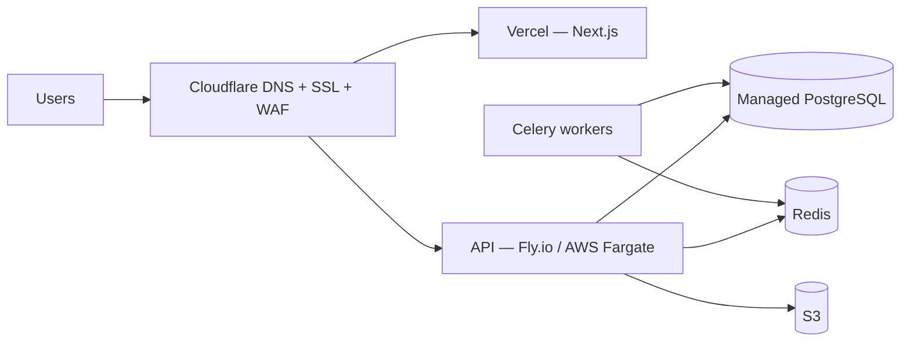

# Deployment Guide — IBKR Indian Tax Assistant

> Local development runs on **Docker Compose**. Cloud Terraform is a complete
> **reference** module set in `infra/` (AWS ap-south-1 + Cloudflare) that
> applies once cloud accounts/credentials are provided. See `ROADMAP.md` for the
> credential-gated items.

## Local development

### Prerequisites
- Docker + Docker Compose
- (For engine work without Docker) Python 3.11+, Node 18+, pnpm

### Quick start
```bash
cp .env.example .env          # then edit secrets
make up                       # postgres, redis, api, worker, web
# API:  http://localhost:8000  (docs at /docs)
# Web:  http://localhost:3000
make seed                     # load versioned tax rules into the DB
```

### Run the engines + tests without Docker
```bash
make install-core             # editable installs of tax-core + ibkr-ingest
make test                     # tax-core (with coverage) + ibkr-ingest
```

### API only
```bash
cd apps/api
pip install -e ../../packages/tax-core -e ../../packages/ibkr-ingest -e ".[test]"
uvicorn ibkr_tax_api.main:app --reload
python -m ibkr_tax_api.services.seed_rules   # seed rules (needs DB)
```

### Web only
```bash
cd apps/web
pnpm install
pnpm dev
```

## Production topology (target)



- **Frontend:** Vercel (auto HTTPS, ISR, previews).
- **Backend:** Fly.io or AWS ECS/Fargate (autoscaling; scale down off-season).
- **DB:** managed PostgreSQL (Neon/Supabase/RDS) with backups + Multi-AZ.
- **Storage:** AWS S3 (SSE-KMS) for statements + generated documents.
- **DNS/SSL:** Cloudflare; custom domain `taxassistant.<yourdomain>`.
- **Secrets:** AWS Secrets Manager / SSM / Doppler.

## CI/CD
- GitHub Actions: lint + typecheck + **engine tests with coverage gate** on PR;
  build/push Docker images; deploy API (Fly/ECS) and web (Vercel) on main.
- Run Alembic migrations as a release step; `seed_rules` is idempotent and safe
  to run each deploy.

## Custom domain + SSL
1. Add domain to Cloudflare; point nameservers.
2. Vercel: add `taxassistant.<yourdomain>` → verify → automatic SSL.
3. API: CNAME/records to the backend host; TLS via platform/Cloudflare.
4. Set `NEXT_PUBLIC_API_URL` and `CORS_ORIGINS` accordingly.

## Observability & endpoints

- **Health/readiness:** `GET /health` (liveness, no DB), `GET /health/ready`
  (rule-config load + DB connectivity; always HTTP 200).
- **Metrics:** `GET /metrics` — Prometheus text exposition (uptime + in-process
  counters), no extra dependency.
- **Logging:** structured single-line JSON; `X-Request-ID` propagated by
  middleware for log correlation. No PII/secrets in logs.
- **Errors:** Sentry-ready — set `SENTRY_DSN` to enable (no-op otherwise).
- **Admin ops:** `GET /api/v1/admin/health` (DB + row counts),
  `POST /api/v1/admin/rules/reseed` (idempotent rule seeding).
- **Auth:** JWT bearer tokens from `POST /api/v1/auth/login`; admin endpoints
  require the `admin` role. Full endpoint catalogue in `API_REFERENCE.md`.

## Operational runbook (essentials)
- Health: `GET /health`, `GET /health/ready`; metrics: `GET /metrics`.
- Backups: automated daily DB snapshots; test restores quarterly.
- Rule updates: edit `config/tax_rules/*.yaml` → PR → deploy → `seed_rules`
  (or `POST /api/v1/admin/rules/reseed`; append-only versioning keeps history +
  audit).
- Migrations: run Alembic (`0001_initial`, `0002_user_mfa_secret`) as a release
  step before serving traffic.
